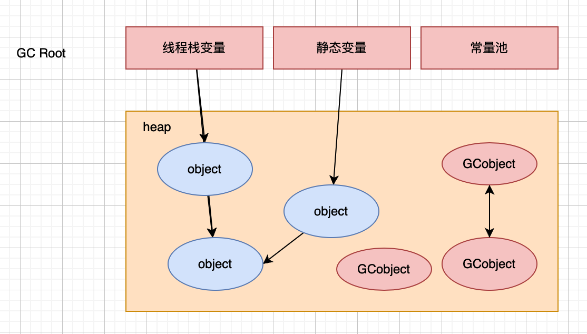
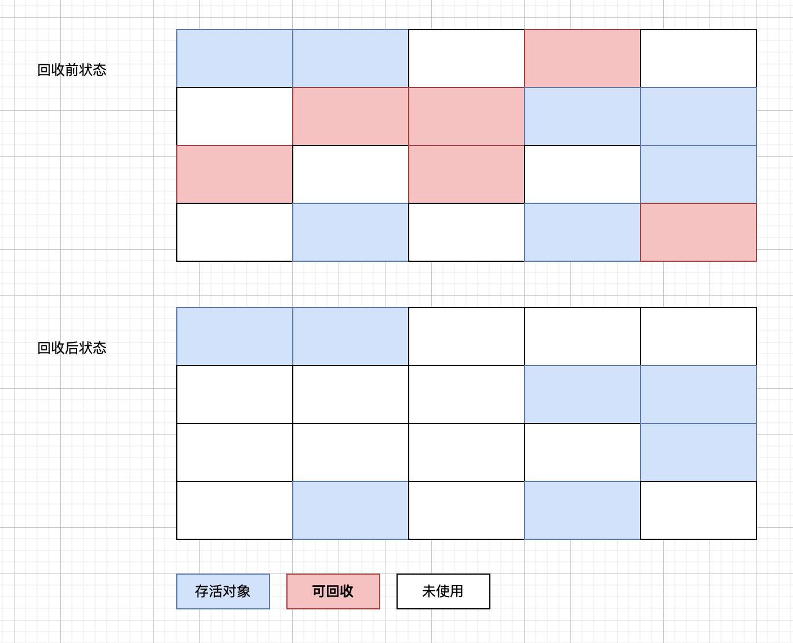

# GC垃圾回收器
## 基本概念
### 1.什么是垃圾
**对于某个对象而言，只要应用程序中持有该对象的引用，就说明该对象不是垃圾，如果一个对象没有任何指针对其引用，它就是垃圾。**

### 2.定位垃圾的方法
1. 引用计数（ReferenceCount）
   
   在对象中添加一个引用计数器，每当有一个地方引用它时，计数器值就加一；当引用失效时，计数器值就减一；任何时刻计数为零的对象就是不可能再被使用的。
   
   **记录有多少个应用程序应用该对象，计数为0，说明该对象可以是垃圾。**
   
    `优势`:原理简单，判定效率高
   
    `弊端`:如果出现AB对象互相引用的情况，导致永远不能回收。（循环引用导致内存泄漏）

2. 根可达算法(RootSearching)

   通过GC Roots的根对象作为起始节点集，从这些节点开始，根据引用关系向下搜索，如果某个对象到GC Roots间没有任何引用链相连（GC Roots到这个对象不可达时），则证明此对象是不可能再被使用的。
   
   **通过GC Roots的引用，开始向下寻找，看某个对象是否可达**

> 在Java技术体系里，可以作为GC Roots的对象包括
>
> - 在虚拟机栈（栈帧中的本地变量表）中引用的对象，如当前正在运行的方法所使用到的参数、局部变量、临时变量等。
> - 在方法区中类静态属性引用的对象，如Java类的引用类型静态变量。
> - 在方法区常量引用的对象，如字符串常量池里的引用。
> - 在本地方法栈中JNI引用的对象。
> - Java虚拟机内部的引用，如基本数据类型对应的Class对象，一些常驻的异常对象（如 NullPointExcepiton，OutOfMemoryError），还有系统类加载器。
> - 所有被同步锁持有的对象。

## 垃圾收集算法

> **已经能够确定一个对象为垃圾之后，接下来要考虑的就是回收，怎么回收呢？得要有对应的算法，下面介绍常见的垃圾回收算法。**

### 1. 标记-清除(Mark-Sweep)

标记出所有需要回收的对象，在标记完成后，统一回收掉所有被标记的对象。反之标记存活的对象，统一回收所有未被标记的对象。

`弊端`:内存空间碎片化

### 2.标记-复制(Mark-Copying)

### 3.标记-整理(Mark-Compact)